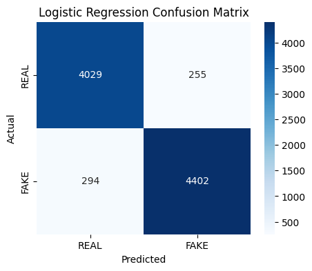
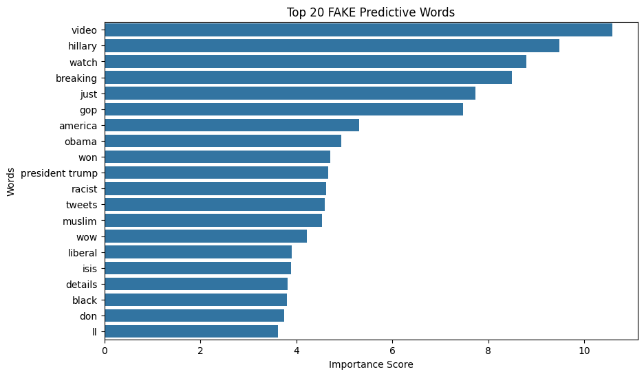

---

# 📊 Project Results

## 🎯 Confusion Matrix



---

## 🔥 Top 20 Fake Predictive Words



---

# 💻 Streamlit Application Preview


---

# ⚙️ Installation Guide

## 1️⃣ Clone the Repository

```bash
git clone https://github.com/Tareque-Hasan20/fake-news-detector.git
cd fake-news-detector
```

---

## 2️⃣ Create Virtual Environment (Optional)

```bash
python -m venv venv
```

### Activate Environment (Windows)

```bash
venv\Scripts\activate
```

---

## 3️⃣ Install Dependencies

```bash
pip install -r requirements.txt
```

---

## 4️⃣ Run the Application

```bash
streamlit run app.py
```

The application will open at:

```bash
http://localhost:8501
```

---

# ☁️ Deployment Platforms

This project can be deployed on:

- Streamlit Community Cloud
- Render
- Hugging Face Spaces

---

# 📈 Model Performance

| Metric | Score |
|---|---|
| Accuracy | 93.88% |
| F1 Score | 94.13% |
| AUC-ROC | 98.42% |

---

# ⚠️ Disclaimer

This project is developed for educational and research purposes only.

The predictions are AI-generated and should not replace professional fact-checking or verified journalism.

---

# ⭐ Support

If you like this project:

- ⭐ Star the repository
- 🍴 Fork the project
- 📢 Share with others

---

# 👨‍💻 Developer

### Md. Tareque Hasan

- 🎓 BSc & MSc in IPE (DUET)
- 💼 Machine Learning & NLP Enthusiast
- 🌍 Gazipur, Dhaka, Bangladesh

---

# 🔗 Connect With Me

- LinkedIn:  
https://www.linkedin.com/in/md-tareque-hasan-a1aa35227

- GitHub:  
https://github.com/Tareque-Hasan20
